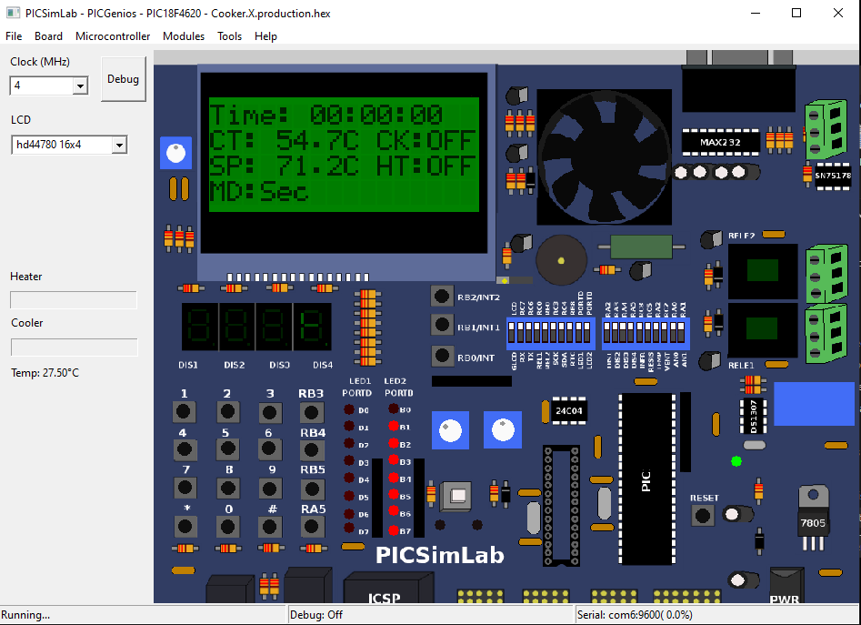

# Microcontrollers-PIC18F4620-Cooker

<pre>
  • Cooker (Heater).
  The cooker will cook at a Controlled Temperature (Setpoint) and controlled Time Interval.
  Using PIC184620
  Used Apps: MPLAB X IDE v5.35 | PicsimLab  
  More details in the PDF File.
</pre>

